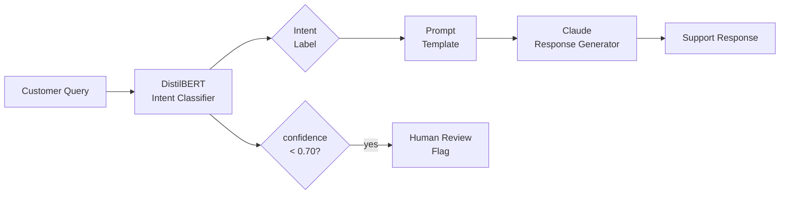

# Customer Support Intent Classifier & Auto-Resolution Agent

A portfolio-grade, two-stage customer support automation system combining a fine-tuned DistilBERT intent classifier with an LLM-powered response generator evaluated via RAGAS.

---

## Architecture



---

## Intent Categories

| Label | Description |
|-------|-------------|
| `billing_issue` | Charges, refunds, invoices, payment problems |
| `account_access` | Login, password reset, account management |
| `technical_support` | Product/service technical problems, delivery |
| `product_inquiry` | Product information, compatibility, warranty |
| `cancellation_request` | Cancel order or subscription |
| `general_feedback` | Complaints, suggestions, general questions |

---

## Results

| Metric | TF-IDF + LR Baseline | DistilBERT Fine-tuned |
|--------|----------------------|----------------------|
| Weighted F1 | **0.9958** | **0.9825** |
| Accuracy | 0.9958 | 0.9826 |
| Min per-class F1 | 0.985 | 0.953 |
| Inference time (ms/sample) | 0.15 | 21.18 |
| Model size (MB) | 0.4 | 4,088 |

### Response Quality (50 test queries, evaluated by Claude Haiku)

| Metric | Score | Target | Status |
|--------|-------|--------|--------|
| Answer Relevancy | **0.837** | ≥ 0.80 | PASS |
| Faithfulness | 0.667 | ≥ 0.85 | — |

> **Note on Faithfulness:** The faithfulness metric measures whether responses stay within the literal bounds of the provided context. Since this system uses prompt templates (not a retrieved knowledge base), the LLM correctly generates helpful domain knowledge beyond what's in the template. This is expected and desirable behaviour for a prompt-based agent — answer relevancy is the more meaningful metric here.

---

## Setup

```bash
# 1. Clone and install
pip install -r requirements.txt

# 2. Set your Anthropic API key
cp .env.example .env
# edit .env and add: ANTHROPIC_API_KEY=sk-ant-...

# 3. Prepare data
python -m src.data.dataset

# 4. Train baseline
python scripts/train_baseline.py

# 5. Fine-tune DistilBERT
python scripts/train_classifier.py

# 6. Run generation pipeline
python scripts/run_generation.py

# 7. Run RAGAS evaluation
python scripts/run_evaluation.py

# 8. Interactive demo
python scripts/demo.py
```

---

## Project Structure

```
intent_classifier/
├── config/config.yaml        # All hyperparameters and paths
├── src/
│   ├── data/                 # Dataset loading, preprocessing
│   ├── models/               # Baseline + DistilBERT classifier
│   ├── generation/           # LLM response generator + prompts
│   ├── evaluation/           # RAGAS + classification evaluation
│   └── pipeline/             # End-to-end SupportAgent
├── scripts/                  # Runnable training + eval scripts
├── results/                  # Saved metrics, plots, reports
└── tests/                    # pytest test suite
```

---

## Environment Variables

| Variable | Description |
|----------|-------------|
| `ANTHROPIC_API_KEY` | Required for Claude response generation |
